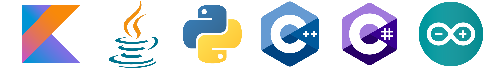

<br clear="both">

<div align="center">
  
</div>

###


###


###


###


```
88        88            88 88                   I8,        8        ,8I                      88          88     88 
88        88            88 88                   `8b       d8b       d8'                      88          88     88
88        88            88 88                    "8,     ,8"8,     ,8"                       88          88     88
88aaaaaaaa88  ,adPPYba, 88 88  ,adPPYba,          Y8     8P Y8     8P  ,adPPYba,  8b,dPPYba, 88  ,adPPYb,88     88
88""""""""88 a8P_____88 88 88 a8"     "8a         `8b   d8' `8b   d8' a8"     "8a 88P'   "Y8 88 a8"    `Y88     88
88        88 8PP""""""" 88 88 8b       d8          `8a a8'   `8a a8'  8b       d8 88         88 8b       88     88
88        88 "8b,   ,aa 88 88 "8a,   ,a8"           `8a8'     `8a8'   "8a,   ,a8" 88         88 "8a,   ,d88     
88        88  `"Ybbd8"' 88 88  `"YbbdP"'             `8'       `8'     `"YbbdP"'  88         88  `"8bbdP"Y8     88
```

<br>
I have been into programming since I was 16. My first language was Python and I am still into it. I am also learning C++, Kotlin (Java), Arduino and C# for Unity. I will be posting my projects here in the public domain and anyone can view them. I also run my YouTube channel, so you can follow me there too 😎.


<p align="left"></p>


<div align="center">
  
</div>


###


<p align="center">
  <a href="https://www.youtube.com/@OpenScriptsOfficial">
      
  </a>

<div align="center">

</div>

<div align="center">

</div>  
</p>

###

</p>
